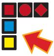
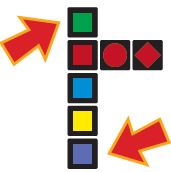

# Qwirkle

## [Rules for playing Qwirkle](https://www.ultraboardgames.com/qwirkle/game-rules.php)

### In the Bag there are:

- 72 blocks

### The blocks have:

- 6 colours
- 6 different shapes
- 2 of each type of shape

| Num/Colour/Shape | Num/Colour/Shape | Num/Colour/Shape | Num/Colour/Shape | Num/Colour/Shape | Num/Colour/Shape |
| --- | --- | --- | --- | --- | --- |
| 2 RED CIRCLE | 2 RED STAR | 2 RED DIAMOND | 2 RED SQUARE | 2 RED STAR | 2 RED CLOVER |
| 2 ORANGE CIRCLE | 2 ORANGE STAR | 2 ORANGE DIAMOND | 2 ORANGE SQUARE | 2 ORANGE STAR | 2 ORANGE CLOVER |
| 2 YELLOW CIRCLE | 2 YELLOW STAR | 2 YELLOW DIAMOND | 2 YELLOW SQUARE | 2 YELLOW STAR | 2 YELLOW CLOVER |
| 2 GREEN CIRCLE | 2 GREEN STAR | 2 GREEN DIAMOND | 2 GREEN SQUARE | 2 GREEN STAR | 2 GREEN CLOVER |
| 2 BLUE CIRCLE | 2 BLUE STAR | 2 BLUE DIAMOND | 2 BLUE SQUARE | 2 BLUE STAR | 2 BLUE CLOVER |
| 2 PURPLE CIRCLE | 2 PURPLE STAR | 2 PURPLE DIAMOND | 2 PURPLE SQUARE | 2 PURPLE STAR | 2 PURPLE CLOVER |

## Game Play

- The game starts with 
  - **2 players** and 
  - an **empty board**
- The tiles are placed **one at a time**
- The players can only replace **one tile at a time**
- Draw a tile to bring your deck again to 6

## Placing a Tile

- A line is either all one shape or all one colour.
- There are no duplicates in a line.
- Tiles that are added to a line must share the same attribute as the tiles that are already in that line.
- The tiles you play must touch (side to side) a tile that has already been played and match the tile in color or shape.
- Any tiles that touch each other are part of a line.

### Examples

A blue square and a yellow square can be added to create a line of squares.



[Source](https://www.ultraboardgames.com/qwirkle/game-rules.php)


There cannot be duplicate tiles in a line.

- A line of squares can only have one blue square. 
- A line can never be longer than six tiles.



[Source](https://www.ultraboardgames.com/qwirkle/game-rules.php)

As the game progresses, spaces will be created where no tile can be played.

## Scoring

When you create a line, you score one point for each tile in that line.

When a tile is part of two different lines, it will score 2 points.

### Qwirkle Bonus

A player gets a bonus 6 points whenever they complete a line of 6 tiles.

This is called a **Qwirkle**.

If a player receives a **Qwirkle**, a message, **"QWIRKLE!!!"**, will be displayed

The game board is displayed after this message.


[Source](https://www.ultraboardgames.com/qwirkle/game-rules.php)

> **Note: Lines of more than 6 tiles are not allowed.**

## End of the Game

When there are no more tiles left, the play continues as before but players don’t replenish their decks at the end of their turns.

The first player who uses all of his tiles ends the game and gets a **6 points bonus**.

The player with the **highest score is the winner** of the game.

When the game ends, the following message is shown:

```html
Game over
Score for <player 1 name>: 000
Score for <player 2 name>: 000
Player <winning player name> won!
Goodbye
```
